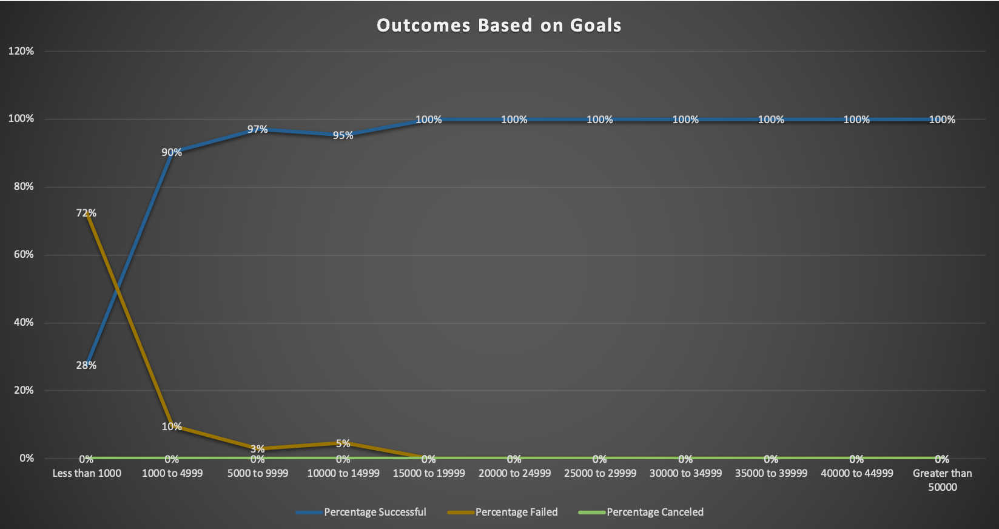

# Kickstarter Analysis Challege 1
Analysis of Kickstarter Campaign outcomes and the effects of timing on success.
### Challenge

In this analysis it is seen that plays are extremely successful in their Kickstarter campaigns in all budget areas except for those under $1,000. Theater Kickstarters in general had the most successes in the month of May. It can be reasonable to assume based on the analyzation of the data that it is not a good idea to launch a theater Kickstarter in the winter months, especially December, which had the loses number of successes, 37, and an almost equal amount of failures, 35.
An additional column in the “outcome based on launch date” sheet and a corresponding graph that describes the percentage of successful theater campaigns for each month would help show if time was an actual factor in success or if the number of success was due just to a high amount of “Grand Total” campaigns in a given month.
The limitations of the analysis we created is that we do not have the rate that it took “Fever” or the other successful campaign to fundraise their money, so it is very difficult to answer this question. Also, we do not have the data for the profits the campaigns made after the projects were fully follow through with, which makes it hard to determine if the various campaigns were good investments to begin with.

